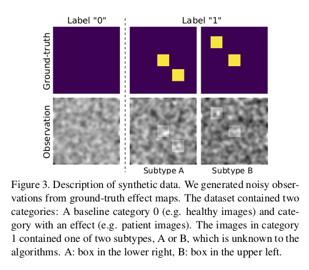

# Visual Feature Attribution Using Wasserstein GANs (with Python and Pytorch)

This code aims to reproduce results obtained in the paper ["Visual Feature Attribution using Wasserstein GANs"](https://arxiv.org/abs/1711)

## Description

This repository contains the code to reproduce results for the paper cited above, where the authors presents a novel feature attribution technique based on Wasserstein Generative Adversarial Networks (WGAN). The code works for both synthetic (2D) and real 3D neuroimaging data, you can check below for a brief description of the two datasets.

### Synthetic Dataset

>"Data:
In order to quantitatively evaluate the performance
of the examined visual attribution methods,  we generated
a  synthetic  dataset  of  10000  112x112  images  with  two
classes, which model a healthy control group (label 0) and a
patient group (label 1). The images were split evenly across
the two categories.  We closely followed the synthetic data
generation process described in [31][[SubCMap: Subject and Condition Specific Effect Maps](https://arxiv.org/abs/1701.02610)]
where disease effects were studied in smaller cohorts of registered images.
The control group (label 0) contained images with ran-
dom iid Gaussian noise convolved with a Gaussian blurring
filter.  Examples are shown in Fig.  3.  The patient images
(label 1) also contained the noise,  but additionally exhib-
ited one of two disease effects which was generated from a
ground-truth effect map: a square in the centre and a square
in the lower right (subtype A), or a square in the centre and a
square in the upper left (subtype B). Importantly, both dis-
ease subtypes shared the same label.   The location of the
off-centre squares was randomly offset in each direction by
a maximum of 5 pixels.  This moving effect was added to
make the problem harder, but had no notable effect on the
outcome."

### ADNI Dataset

>"We selected 5778 3D T1-weighted MR images from
1288 subjects with either an MCI (label 0) or AD (label 1) diagnosis from the ADNI cohort. 2839 of the images
were acquired using a 1.5T magnet, the remainder using a
3T magnet. The subjects are scanned at regular intervals as
part of the ADNI study and a number of subjects converted
from MCI to AD over the years. We did not use these cor-
respondences for training, however, we took advantage of it
for evaluation as will be described later.
All images were processed using standard operations
available in the FSL toolbox [52][[Advances in functional and structural MR 
image analysis and implementation as FSL.](https://www.ncbi.nlm.nih.gov/pubmed/15501092)] in order to reorient and
rigidly register the images to MNI space, crop them and
correct for field inhomogeneities. We then skull-stripped
the images using the ROBEX algorithm [24][[Robust brain extraction across datasets and comparison with
publicly available methods](https://www.ncbi.nlm.nih.gov/pubmed/21880566)]. Lastly, we
resampled all images to a resolution of 1.3 mm 3 and nor-
malised them to a range from -1 to 1. The final volumes
had a size of 128x160x112 voxels."

>"Data used in preparation of this article were obtained from
the Alzheimers Disease Neuroimaging Initiative (ADNI) database
([adni.loni.usc.edu](http://adni.loni.usc.edu)).
As such, the investigators within the ADNI
contributed to the design and implementation of ADNI and/or provided data but 
did not participate in analysis or writing of this
report. A complete listing of ADNI investigators can be found at:
[http://adni.loni.usc.edu/wp-content/uploads/how_to_apply/ADNI_Acknowledgement_List.pdf](http://adni.loni.usc.edu/wp-content/uploads/how_to_apply/ADNI_Acknowledgement_List.pdf)"

## Usage

### Synthetic data generation
In order to generate the synthetic dataset, cd into this repo's `src` root folder and execute:

    $ python generate_synth_data.py

This script takes the following command line options:

- `out_dir`: directory for the generated files (default to `../dataset/`)

- `image_size`: width and heigth for the generated images

- `square_size`: width and heigth for the inner squares in the masks (anomaly size)

- `offset`: maximum absolute offset in pixels for the off-centre inner squares in the masks (off centre anomalies max offset)

- `num_samples`: number of samples to generate for each label (`total samples = num_samples * 2`)

Running the command without arguments will generate a total of 20k 1x112x112 png images (10k images in `data` and 10k masks in `masks`, masks are not needed for this prroject), with inner squares of 20x20 pixels and a maximum random offset for the offcentre squares of 5 pixels. 

### Training

To train the WGAN on this task, cd into this repo's `src` root folder and execute:

    $ python train.py

This script takes the following command line options:

- `dataset`: the name of the dataset (`synth` or `real`)

- `dataset_root`: the root directory where tha dataset is stored

- `image_size`: width and heigth for the generated images

- `square_size`: width and heigth for the inner squares in the masks (anomaly size)

- `offset`: maximum absolute offset in pixels for the off-centre inner squares in the masks (off centre anomalies max offset)

- `num_samples`: number of samples to generate for each label (`total samples = num_samples * 2`)

Running the command without arguments will generate a total of 20k 1x112x112 png images (10k images in `data` and 10k masks in `masks`, masks are not needed for this prroject), with inner squares of 20x20 pixels and a maximum random offset for the offcentre squares of 5 pixels. 

## Results

## Useful repositories and code

 - [ganhacks](https://github.com/soumith/ganhacks): Starter from "How to Train a GAN?" at NIPS2016

 - [WassersteinGAN](https://github.com/martinarjovsky/WassersteinGAN): Code accompanying the paper "Wasserstein GAN"

 - [wgan-gp](https://github.com/caogang/wgan-gp): Pytorch implementation of Paper "Improved Training of Wasserstein GANs".

 - [c3d-pytorch](https://github.com/DavideA/c3d-pytorch/blob/master/C3D_model.py): Model used as discriminator in the reference paper

## .bib citation
cite the paper as follow (copied-pasted it from arxiv for you):

    @article{DBLP:journals/corr/abs-1711-08998,
      author    = {Christian F. Baumgartner and
                   Lisa M. Koch and
                   Kerem Can Tezcan and
                   Jia Xi Ang and
                   Ender Konukoglu},
      title     = {Visual Feature Attribution using Wasserstein GANs},
      journal   = {CoRR},
      volume    = {abs/1711.08998},
      year      = {2017},
      url       = {http://arxiv.org/abs/1711.08998},
      archivePrefix = {arXiv},
      eprint    = {1711.08998},
      timestamp = {Sun, 03 Dec 2017 12:38:15 +0100},
      biburl    = {http://dblp.org/rec/bib/journals/corr/abs-1711-08998},
      bibsource = {dblp computer science bibliography, http://dblp.org}
    }
